<picture>
 <source media="(prefers-color-scheme: dark)" srcset="header/HeaderForDark.svg">
 <source media="(prefers-color-scheme: light)" srcset="header/Header.svg">
 
</picture>

# Forwoth

<h4 align=center>Forwothは、勉強や覚えたいことそのものの行動を記録します。</h4>

<p align=center>


</p>

---

## Table of contents
- [Forwoth](#forwoth)
  - [Table of contents](#table-of-contents)
  - [About](#about)
  - [Installation](#installation)
  - [Features](#features)
  - [How to USE](#how-to-use)
    - [FIRST](#first)
    - [Second](#second)
    - [THIRD](#third)
    - [FOUTH](#fouth)
  - [How to Build](#how-to-build)
    - [1.Maven Build](#1maven-build)
    - [2.VSCode Build](#2vscode-build)
  - [Used Materials](#used-materials)
    - [・Library Use](#library-use)
    - [・Other Materials](#other-materials)
  - [Reason for Creation](#reason-for-creation)
  - [Origin of the Name](#origin-of-the-name)
  - [Key Ideas \& Self-Analysis](#key-ideas--self-analysis)
  - [Impressions / Reflections](#impressions--reflections)
- [Author](#author)

## About


>[!WARNING]
>このプロジェクトはまだ開発中です。動作の安定性やデータの安全性は保証できません。 
> 学習・作品展示を目的として公開しています。  実際の環境での利用は十分にご注意ください。

ForWothは勉強の**内容**・**日付**・**時間**を記録し、あなたのペースに合わせた忘却曲線に従って通知・スケジュール管理する学習向上ソフトです。


## Installation

[Release](https://github.com/ThirstyKanta/Forwoth/releases/tag/%23release-demo)から最新のJarファイルをダウンロードしてください。
> [!IMPORTANT]
>Javaをダウンロードし、インストールしてください。
>VersionはVersion 17 以降のものを使用してください。[Java Version 17](https://www.oracle.com/java/technologies/javase/jdk17-archive-downloads.html),[Java Version Latest](https://www.oracle.com/jp/java/technologies/downloads/)

> [!WARNING]
> 現在時点では開発途中で機能不足です。
>[Features](#features)にて機能の状況を把握することができます。
>本プロジェクトは就活用に作成したものであり、バクなども多数存在いたします。ご了承ください。


## Features 


|機能       |説明 |状況  |
|:---------:|:----------------------------------------------|:------:|
|内容の記録|テーブル形式での内容の記録やタイトルアイコンの新規作成| 実装済み。|
|Jsonのエクスポート・インポート|内容のセーブデータを保存・開くことができる|実装済み|
|復習機能|忘却曲線に従って復習タイミング知らせてくれる|実装済み|
|タイマー機能|記録別で時間を測定できる|実装済み|
|言語機能|言語変更に対応|日本語・英語(AIを使用し翻訳)実装|
|全般設定|詳細を設定できる| 実装済み|
|分類機能|フォルダとして作成し、要素をまとめられる。| 実装予定|
|ポモドーロ機能| ポモドーロ効果を利用。任意の区間を設定しそれに従って測定できる|実装予定|


## How to USE 

### FIRST
最初に、起動すると設定ファイルが作成されます。
プログラムにより、ファイルがないと判断された場合以下のように表示されます。

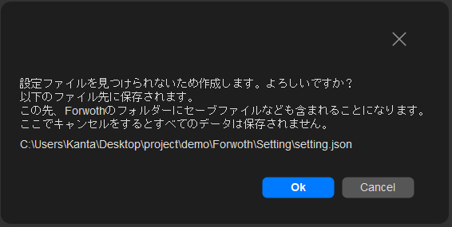

もし余計なファイル作成したくない、サンプルを見てみたいという場合は、
[Release](https://github.com/ThirstyKanta/Forwoth/releases/tag/%23release-demo)のサンプルデータ付きを選んでいただくと余計なファイルをデスクに残さず作成できます。

### Second
次に本体の基本的な機能から説明していきます。
全体図は以下の画像のようになっています。

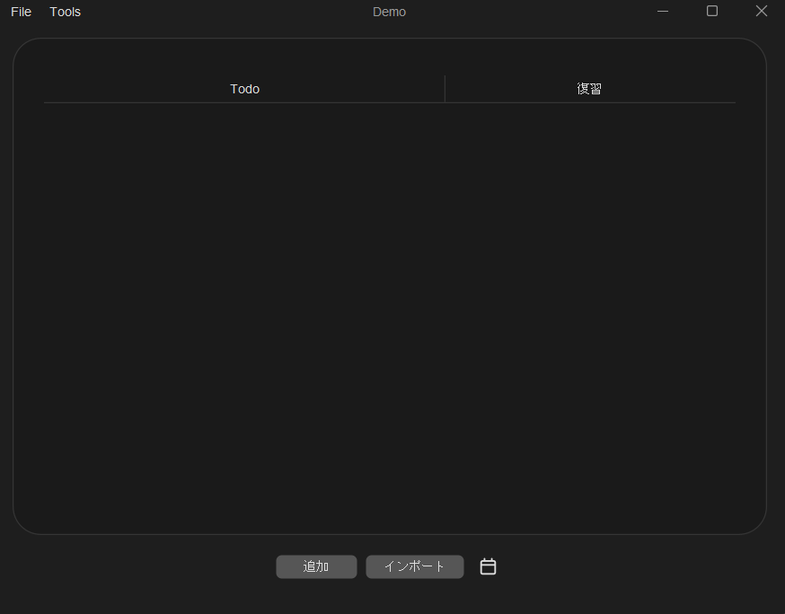

まず、下のボタンから説明します。
下のボタンの**追加**は、真ん中のTodoという場所に自分が学習したいことを登録します。
登録できる内容は「タイトル、アイコン、記録日時、記録時間、内容」となっております。
登録画面はこのようになっています。


<table>
 <tr>
  <td>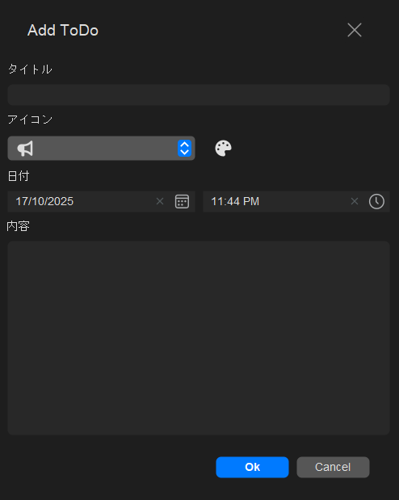</td>
  <td><a href="https://github.com/DJ-Raven/swing-datetime-picker">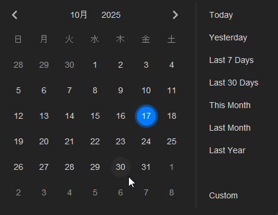</a></td>
  <td><a href="https://github.com/DJ-Raven/swing-color-picker">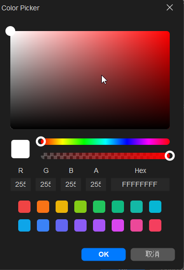</a></td>
  <td><a href="https://github.com/DJ-Raven/swing-datetime-picker">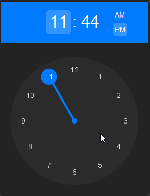</a></td>
  </tr>
</table>

**Add ToDoダイログ**のOKを選択すると内容がテーブルに反映されます。
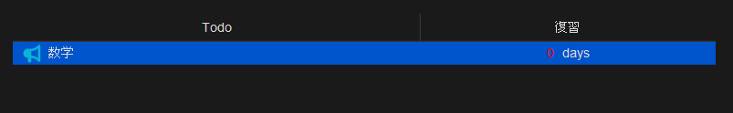

---

次は**インポート**を説明します。
これは文字通り、セーブデータと同じ形式（ソフトバージョンが一致していないと不具合を起こす可能性があります。）記録されたJSONファイルをインポートできます。

>[!IMPORTANT]
>現時点ではインポートは保存された設定以外のデータをすべて上書きします。
>設定ファイルはインポートでは追加できません。

---

次は**カレンダーのアイコン**のボタンを説明します。
これは、すべての登録されたデータがすべて閲覧できます。
後ほど説明しますが、テーブルには表示日数というものがあり
その日数を超えるとテーブルから見えなくなります。
なので表示日数に関係なく閲覧できるブラウザーの役割を担っています。


>[!IMPORTANT]
>現時点ではブラウザーは閲覧する機能しか持ち合わせていません。


### THIRD
次はテーブルについて説明します。


まず左は登録したタイトル名と、復習欄はあと何日後に復習するかを表示ししています。

要素の上にカーソルを置いて右クリックをすると
「削除、名前の変更」のアクションを行えます。

>[!IMPORTANT]
>現時点ではそれぞれのアクション後に警告などは表示されません。
>今後実装予定です。

---

同じように要素の上でダブルクリックを行うと「タイトル、内容、記録日時」の閲覧とタイマーが表示されます。


右の面、記録日時の下の**難しさ**があります。
ここで体感的な難易度のことを指します。
それぞれ「EASY,NORMAL,HARD」とあります。
左の面で時間測定後選択し、YESを選択するとその指定に合わせた日数が確保されます。

>[!IMPORTANT]
>この時、要素の内容は編集ができません。（今後の実装予定）

### FOUTH

上部のメニューバーについて
説明します。

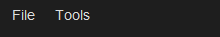


この二つの項目ですが、
**File**では「名前を付けて保存と保存」があります。
ファイル名を付けて任意の場所に保存する。
または既存の場所に上書き保存するのどちらかになります。

---
**Tools**では、現在、Settingのみ選択でき、「保存先、言語、テーマ、表示日数」が選択できます。

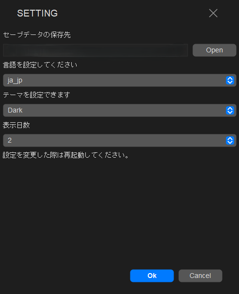


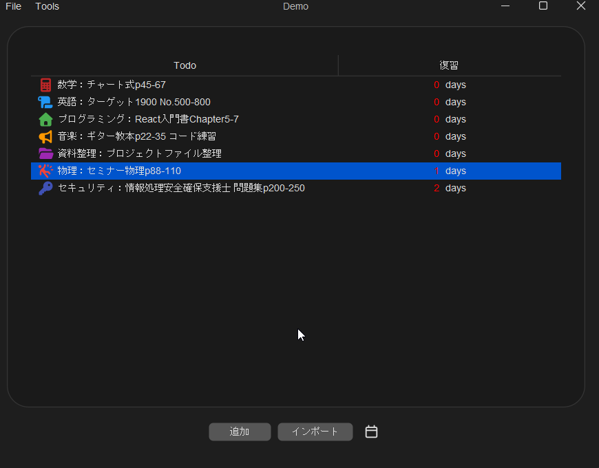
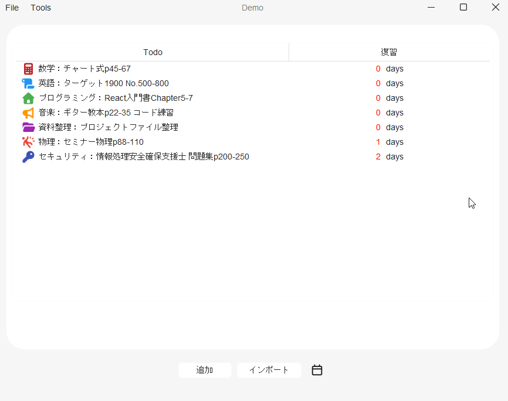


## How to Build

**必須バージョン**


### 1.Maven Build


最初にクローンを行い、そのフォルダー内に入ります。

```bash
git clone https://github.com/ThirstyKanta/Forwoth.git
cd Forwoth
```

その後、以下のコマンドを実行してください。

``` bash
>mvn clean install
>mvn package
```

### 2.VSCode Build


1.最初に、[VSCode](https://code.visualstudio.com/)をインストール、ダウンロードしてください。

2.Javaの「[Java Extension Pack](https://marketplace.visualstudio.com/items?itemName=vscjava.vscode-java-pack)」アドオンをダウンロード後、してください。

3.クローンを行った後、そのフォルダーを開くことでJava Extension Packによって自動で
ビルドできます。

以下のボタンを押した場合でもビルドすることはできますが、警告がでることがあります。

[](vscode://vscode-remote/github/ThirstyKanta/Forwoth)


## Used Materials

### ・Library Use
| ライブラリ | バージョン | ライセンス |
|---|---:|---|
| jackson-annotations | 3.0-rc5 | Apache-2.0
| flatlaf | 3.6.1 | Apache-2.0|
| flatlaf-extras | 3.6.1 |Apache-2.0 |
| flatlaf-fonts-roboto | 2.137 | Apache-2.0
| jsvg | 2.0.0 | MIT |
| miglayout-core | 11.4.2 | BSD |
| miglayout-swing | 11.4.2 | BSD |
| commons-io | 2.20.0 | Apache-2.0 |
| modal-dialog | 2.5.2 | MIT License |
| swing-color-picker | 1.0.0 | MIT License |
| swing-datetime-picker | 2.1.3 | MIT License |
| jackson-core | 3.0.0 |Apache-2.0|
| jackson-databind | 3.0.0 |Apache-2.0　|


### ・Other Materials
| 素材名　| 説明 |ライセンス|
|:---------|:-----|:------:|
|[Font Awesome Free](https://fontawesome.com)| 本プロジェクトでは [Font Awesome Free](https://fontawesome.com)を利用しています。| CC BY 4.0|

----

ここから先は、私の作成理由などの熱量を表したものになりますので読み飛ばしても問題はありません。
お時間がありましたら、一読していただけると幸いです。

---
<table>
<tr>
<td>

## Reason for Creation

**Forwoth**は、就職活動を始めるにあたってプログラマーになりたいという熱量を表すために作成したものです。

しかし、その目的だけではなく「自分の作りたい物で示したい」と思い、自分の習慣的な学習においての不満があり、
復習のスケジュール管理があまりできていないことが悩みでした。勉強や学習において、記憶ができていないと自信を無くすことは多々あると思います。
ただ、それを正しく復習できていると少しでも自信を持てるそのソフトを開発したい。

そこで<a href=https://apps.ankiweb.net/>Anki</a>というソフトにインスピレーションを受け、忘却曲線を利用した復習管理をしてくれる勉強記録用タイマーのソフトを作成したいと思いました。

今後しっかりと使用感を向上させ、ソフトとしての初めての作品になると思います。

## Origin of the Name

記憶術などで有名な<a href=https://ja.wikipedia.org/wiki/%E5%BF%98%E5%8D%B4%E6%9B%B2%E7%B7%9A>エビングハウスの忘却曲線</a>というものをご存じでしょうか。

記憶時間の節約率を表したもので。思いだすたびに、その節約率が高くなっていくというものです。時間と共に記憶は指数関数的に下がっていきます。
これを言い換えると、記憶することと同等に忘れることにも同様の価値があるのではないかと思えたのです。

そこでForgetとWorthを合わせて造語にしたForwoth(フォーワス)という名前にすることを決めました。

## Key Ideas & Self-Analysis

個人的な課題としてSwingライブラリのUIが古く、**視認性にかけてしまう**という点がありました。
そこでFlatlafライブラリと、その派生となるライブラリを使用し、**視認性も向上ができた**のは個人的には評価しています。

現在の想定では様々な機能を追加し自分の勉強向上のため、将来的に利用する方がいてくれるまでになれば満足です。

自己分析の結果、JSONのデータ保管の観点から懸念があると同時に、設計の問題も多々あることを理解しております。

利用者にとってはそれが重大な問題になると自覚しており、今後の改良で改善していく予定です。

## Impressions / Reflections

幼い頃に趣味で学習していた知識を使い、わからないときはその都度調べ、学習をしました。

初めて利用する側のことを考えながら作成しました。
それでも改めてコードを見返すと課題も多く感じられ、無理やりな実装だったり就活のことを横において、実装したい機能などに寄り道をし、かなり時間をかけてしまったと思います。自分の能力を示す「**一成果物**」としてある程度の形をWIP版としてリリースしていますが、まだ機能も少ないのが現状です。

最終的には、自分の学習向上に加えて、他の人にも使ってもらえるソフトになることを目指しています。

初めてReadMeの作成をしたので構成や読みずらかったかもしれませんが、読みやすさを意識して書きました。

ここまで読んでいただきありがとうございました。

</td>
</tr>
</table>

# Author
*ThirthyKanta*
